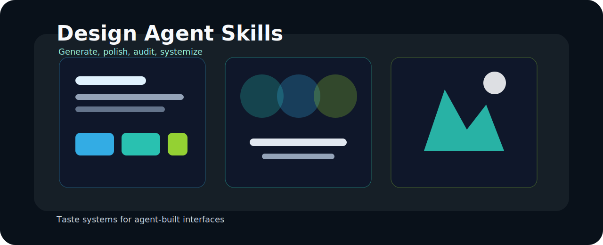

  

<h1 align="center">Awesome Design Agent Skills</h1>

  <strong>A ranked design-quality layer for Claude Code, Codex, Cursor, Gemini CLI, v0, Lovable, and the next wave of UI agents.</strong>

  
  
  

  <a href="#tldr">TL;DR</a> ·
  <a href="#start-here">Start here</a> ·
  <a href="rubrics/anti-slop-rubric.md">Anti-slop rubric</a> ·
  <a href="examples/before-after-gallery.md">Gallery</a> ·
  <a href="ARCHITECTURE.md">Architecture</a>

A curated map of design skills for AI coding agents: Claude Code, Codex, Cursor, Gemini CLI, v0, Lovable, and beyond.

## Quality Thesis

| Layer | What this repo helps decide |
| --- | --- |
| Generation | Which skills reliably produce stronger first-pass product UI. |
| Polish | Which resources improve hierarchy, spacing, motion, color, and density. |
| Audit | Which rubrics catch generic AI UI before it ships. |
| Systemization | Which patterns make design output reusable across products and teams. |

## TL;DR

This is not a giant dump of links. It is a design-specific curation layer for people who want better AI-generated UI, stronger brand systems, more tasteful motion, and sharper design audits — all powered by explicit loops (not raw prompts) using DESIGN.md, SKILL.md, rubrics, and hooks for L99 output across agents including Codex.

| If you want to… | Start here |
| --- | --- |
| Avoid generic AI UI | [Anti-slop rubric](./rubrics/anti-slop-rubric.md) |
| Find the best overall UI generation resources | [Best frontend design skills](./rankings/best-frontend-design-skills.md) |
| Improve motion and interaction polish | [Best motion skills](./rankings/best-motion-skills.md) |
| Build a coherent visual system | [Best brand system skills](./rankings/best-brand-system-skills.md) |
| Critique and improve weak interfaces | [Best design audit skills](./rankings/best-design-audit-skills.md) |
| See the kind of improvement these skills should create | [Before / after gallery](./examples/before-after-gallery.md) |

## Why this repo exists

Generic skill aggregators already exist. This repo focuses on the narrower problem: **which skills actually improve design output** for product UI, motion, brand systems, and design audits.

The goal is not to list everything. The goal is to help people quickly find the highest-signal design-oriented skills, prompts, and reference repos.

## Start here

- [Best frontend design skills](./rankings/best-frontend-design-skills.md)
- [Best motion skills](./rankings/best-motion-skills.md)
- [Best brand system skills](./rankings/best-brand-system-skills.md)
- [Best design audit skills](./rankings/best-design-audit-skills.md)
- [Anti-slop rubric](./rubrics/anti-slop-rubric.md)
- [AI UI quality rubric](./rubrics/ai-ui-quality-rubric.md)
- [Before / after gallery](./examples/before-after-gallery.md)
- [Repository architecture](./ARCHITECTURE.md)
- [Contributing guide](./CONTRIBUTING.md)

## How to use this repo

### If you are generating UI

Start with [Best frontend design skills](./rankings/best-frontend-design-skills.md), then use the [Anti-slop rubric](./rubrics/anti-slop-rubric.md) to pressure-test the output.

### If you are polishing interaction quality

Pair [Best motion skills](./rankings/best-motion-skills.md) with the [AI UI quality rubric](./rubrics/ai-ui-quality-rubric.md) to evaluate state changes, transitions, and perceived quality.

### If you are building a visual system

Use [Best brand system skills](./rankings/best-brand-system-skills.md) and then verify consistency across components and screens with the [AI UI quality rubric](./rubrics/ai-ui-quality-rubric.md).

### If you are auditing weak output

Start with [Best design audit skills](./rankings/best-design-audit-skills.md), then score the result with the [Anti-slop rubric](./rubrics/anti-slop-rubric.md).

## Positioning

This repository should become the **design-specific discovery layer** on top of broader agent-skill directories.

It should answer questions like:

- Which skills produce non-generic UI?
- Which skills are strongest for motion and polish?
- Which resources help generate coherent brand systems?
- Which prompts or skills are useful for auditing weak AI-generated interfaces?

## Curation philosophy

This repo filters for **taste, quality, and practical design usefulness** rather than raw popularity. A smaller list with sharper judgment is more useful than a huge directory of loosely related links.

A resource belongs higher when it improves real shipped output: stronger hierarchy, clearer interaction design, more coherent systems, and less generic AI sameness.

## Already serious aggregators

These resources already matter, and this repo should complement them rather than duplicate them.

| Repo / Resource | What it is | Why it matters |
| --- | --- | --- |
| [VoltAgent/awesome-agent-skills](https://github.com/VoltAgent/awesome-agent-skills) | 1000+ agent skills compatible with Claude Code, Codex, Gemini CLI, Cursor, and more | The generic aggregator already exists. This repo should filter the design-specific winners from it. |
| [travisvn/awesome-claude-skills](https://github.com/travisvn/awesome-claude-skills) | Curated Claude Skills list | Strong Claude-specific discovery layer and useful source of design-adjacent skills. |
| [Anthropic frontend-design skill](https://github.com/anthropics/claude-code/tree/main/plugins/frontend-design) | Official-ish frontend design skill inside the Claude Code repo | A strong baseline for anti-slop frontend generation and a useful reference standard. |
| [VoltAgent/awesome-claude-design](https://github.com/VoltAgent/awesome-claude-design) | Ready-to-use `DESIGN.md` inspirations | Useful prompt and template layer for design-system-driven UI generation. |
| [bergside/awesome-design-skills](https://github.com/bergside/awesome-design-skills) | Curated design skill files for Claude Code, Cursor, Codex, and others | The closest existing repo to an "awesome design skills" concept. |
| [starlight-design-intelligence](https://github.com/frankxai/starlight-design-intelligence) | Starlight design system constraints and automation checks | Enforces brand constraints, premium typography, and UI quality gates across swarms. |

## What belongs here

High-signal content for this repo:

- Ranked lists by use case, not just by popularity
- Rubrics for evaluating whether a skill avoids generic AI UI
- Side-by-side before/after examples showing what good design guidance changes
- Short explanations of when to use a skill, not just links
- Cross-tool coverage for Claude Code, Codex, Cursor, Gemini CLI, v0, Lovable, and similar products

Low-signal content to avoid:

- Giant unsorted dumps of links
- Repositories with no design-specific angle
- Prompt packs with no visible output quality bar
- Lists that only track stars instead of actual design usefulness

## Initial curation principles

A resource should rank higher when it:

1. Produces distinctive, production-grade interfaces instead of generic AI UI
2. Encodes taste, hierarchy, spacing, typography, and motion guidance
3. Works across real coding-agent workflows, not only in chat
4. Helps with system-level consistency, not just single-screen mockups
5. Includes examples, templates, or skill files people can reuse directly

## Suggested next expansion (Prioritized for L99 Top-Notch)

- Add more design-skill sources as they appear (VoltAgent, new GSAP releases, fresh premium 2026 systems)
- Add concrete full-loop traces + before/after from real L99 runs (use examples/ + link from rankings)
- Separate + expand rankings by workflow stage (already started): generation, polish, audit, systemization, brand fidelity
- Track which skills are strongest by agent ecosystem (Codex vs Claude vs Grok) with evidence scores
- Maintain rubrics/premium-generation-gate.md and anti-slop as living documents — update from meta-loop outcomes
- Cross-link every ranking entry to the exact skill file in design-agent-skills/ and to DESIGN.md tokens
- Add "setup" guidance: how to adopt the whole system via ADOPTION_SCRIPT + starlight-design-agent-skills hooks

## How to Contribute (High Bar)
1. Only submit resources that have been shown (with evidence) to raise output from <80 to 95+ on the rubrics.
2. Include why it beats generic / raw prompting (loop structure, tokens, critic, GSAP, etc.).
3. Update at least one ranking list + the anti-slop or premium gate if relevant.
4. Prefer agent-agnostic over single-harness.

This repo + design-agent-standards + design-agent-skills together form the complete "awesome + executable + enforced" design intelligence layer.

Run ADOPTION_SCRIPT.ps1 in consuming repos. See DESIGN_TASTE.md L99 section for ensure-everywhere matrix.
