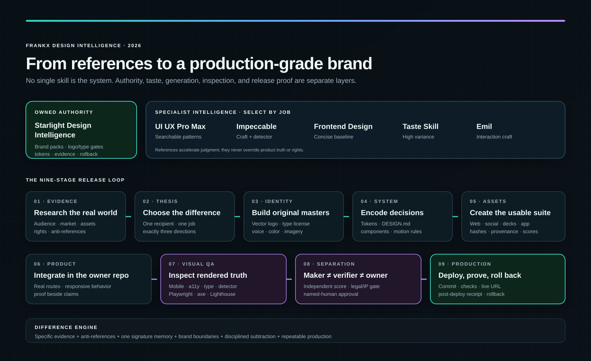

# Awesome Design Agent Skills

**Code-driven design automation rules and UX schemas.**

---

## Start with the complete stack

The 2026 comparison is not another unverified prompt list. It separates discovery,
specialist acceleration, owned brand authority, rendered inspection, and production
proof.

- **[End-to-end brand and design-agent stack](./rankings/end-to-end-brand-design-stack.md)** — current leaders, machine install state, gaps, adoption decisions, and the complete brand-to-production workflow.
- **[Best frontend design skills](./rankings/best-frontend-design-skills.md)** — generation and implementation.
- **[Best brand system skills](./rankings/best-brand-system-skills.md)** — strategy, identity, tokens, and governance.
- **[Best motion skills](./rankings/best-motion-skills.md)** — interaction and motion craft.
- **[Best design audit skills](./rankings/best-design-audit-skills.md)** — deterministic and human review.
- **[Ultimate loops](./rankings/ultimate-loops.md)** — how to compose the tools without losing authority.

## Cross-harness registry (2026-08)

Every agentic design skill on GitHub, live-verified per harness: **[registry/](./registry/README.md)** — [Claude Code](./registry/claude-code.md) · [Codex](./registry/codex.md) · [Gemini CLI + Antigravity](./registry/gemini-antigravity.md) · [Grok](./registry/grok.md) · [Cursor](./registry/cursor.md) · [cross-harness standards](./registry/cross-harness.md) · [registry.json](./registry/registry.json) (machine-readable).

The headline finding: the three biggest **this-repo** design skills (ui-ux-pro-max, taste-skill, impeccable) are harness-agnostic SKILL.md packs — quality now follows the installed pack, not the harness. Parent-pack star counts (e.g. `frontend-design` inside `anthropics/skills`) are labeled in the registry and **never** used for scale or rank. See [star-count honesty](./registry/README.md#star-count-honesty).

## Knowledge layer

- **[How elite web teams actually work](./docs/how-elite-web-teams-work.md)** — the sourced 10-phase studio SOP, Awwwards' real 40/30/20/10 rubric, 15 anti-generic principles, and a slop-vs-craft voice guide.
- [The 2026 premium web stack](./docs/premium-web-stack-2026.md) — verified library, icon, type, and image-model landscape, including the ten things agents most often get wrong.
- **Instruments** (run from repo root): `node scripts/slop-scan.mjs <file>` (copy lint) · `scripts/qa-probe.js` (paste into a live page) · `node scripts/eval-instruments.mjs` (standing eval) · `node docs/site/build-plate.mjs` (recompile the survey plate after registry edits).

## Current high-signal stack

| Job | Recommended leader | Use it for |
| --- | --- | --- |
| Pattern intelligence | [UI UX Pro Max](https://github.com/nextlevelbuilder/ui-ux-pro-max-skill) | Searchable styles, product types, palettes, typography, UX rules, and stack guidance |
| Frontend critique and polish | [Impeccable](https://github.com/pbakaus/impeccable) | Product/brand shaping, browser iteration, 23 commands, deterministic anti-pattern detection |
| Concise frontend baseline | [Anthropic `frontend-design`](https://github.com/anthropics/skills/tree/main/skills/frontend-design) | Subject-grounded composition, type, hierarchy, and signature detail |
| High-variance marketing UI | [Taste Skill](https://github.com/Leonxlnx/taste-skill) | Opinionated anti-slop direction for landing pages and portfolios |
| Interaction craft | [Emil Kowalski skills](https://github.com/emilkowalski/skills) | Motion frequency, easing, interruption, microinteractions, and reduced motion |
| DESIGN.md extraction | [ibelick/ui-skills](https://github.com/ibelick/ui-skills) | Evidence-led design-system recovery |
| UI compliance | [Vercel Agent Skills](https://github.com/vercel-labs/agent-skills) | Current web-interface guideline audit |
| Owned authority | [Starlight Design Intelligence](https://github.com/frankxai/starlight-design-intelligence) | Brand packs, logo/type rights, quality gates, approval, and release-contract requirements |

> [!IMPORTANT]
> No public skill is an end-to-end brand authority. Generated logos are not vector
> masters; font presence is not licensing; screenshots are not production proof;
> stars are not quality scores. Use the full evidence and release loop.

<!-- Keep the two GitHub callouts distinct for markdownlint MD028. -->

> [!TIP]
> New to agent skills? Start with the [Getting Started Guide](./GETTING_STARTED.md),
> then use the [anti-slop rubric](./rubrics/anti-slop-rubric.md) on a rendered result.

## How it integrates

- This repository is the public curation and comparison layer.
- [`starlight-design-intelligence`](https://github.com/frankxai/starlight-design-intelligence) is the owned design authority and release-contract layer.
- Product repositories own their implementation, production deployment, evidence, and rollback.
- External skills accelerate a named stage; they never silently become brand authority.

---

## 🛠️ Contributing & Standards

We welcome contributions that align with our core thesis of verifiable, world-healing, and rigorously-tested agent intelligence.

Please read our [CONTRIBUTING.md](./CONTRIBUTING.md) for details on our code of conduct, and the process for submitting pull requests.

## 📄 License

This project is licensed under the MIT License - see the [LICENSE](./LICENSE) file for details.

  Built with ❤️ by the FrankX Superintelligence System

