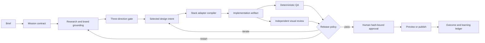

# Multi-Agent Design Product Blueprint

**Status:** decision proposal

**Evidence date:** 2026-08-05

**Scope:** design-agent skills, multi-agent design operations, runtime adapters, web-stack adapters, premium asset systems, and visual release governance

## Executive decision

Build **one design-intelligence kernel with multiple runtime and stack adapters**, not six unrelated products for six agent platforms.

The recommended portfolio is:

1. **Open Design Protocol** — open-core schemas, baseline skills, rubrics, examples, and adapter SDK.
2. **Design Foundry** — the paid local/team product that runs the governed multi-agent design loop.
3. **Platform editions** — thin packaging for Claude Code, Codex, Antigravity, Grok Build, OpenCode, and Hermes Agent.
4. **Stack packs** — Next.js/Vercel/v0 first; static HTML/CSS second; Webflow third; motion and 3D as governed capability packs.
5. **Premium intelligence packs** — brand systems, component and asset registries, motion direction, visual QA, and enterprise governance.

The moat is not another prompt library. The moat is a **versioned design contract, evidence-producing execution loop, brand memory, stack-aware adapters, independent visual QA, and a human-owned release gate**.

> The market has many ways to make a first draft. It still lacks a portable system that proves the draft is coherent, accessible, performant, brand-specific, legally usable, and ready to ship.

## Terminology normalization

The original request appears to contain voice-transcription substitutions:

| Heard term | Working interpretation | Confidence |
| --- | --- | --- |
| Skype | skills | high |
| Verso | Vercel | high |
| vZero | v0 | high |
| RockBuild | [Grok Build](https://docs.x.ai/build/overview) | medium-high; this is the closest verified official product name |

The architecture below does not depend on those interpretations being perfect. Each surface is isolated behind an adapter.

## Evidence boundary

This is a remote architecture and repository review, not an adoption benchmark.

- Official documentation and primary GitHub repositories were inspected.
- Repository metadata, root structure, skill/plugin packaging, declared license posture, and README claims were checked.
- Third-party packages were **not** cloned, installed, executed, authenticated, or security-tested.
- Star counts are dated attention signals only and were not used as quality scores.
- Product recommendations are clearly separated from sourced facts.

## Current open-core audit

### What already exists

`awesome-design-agent-skills` has the right public role: web-first discovery, rankings, rubrics, examples, and broad design-agent quality guidance.

The latest draft curation candidate reviewed was PR [#2](https://github.com/frankxai/awesome-design-agent-skills/pull/2), commit `36918d8`, on 2026-08-05.

Observed repository shape, reproduced from a local tracked-file and Markdown scan of the checked-out PR candidate:

| Measure | Observed candidate state |
| --- | ---: |
| Tracked files | 27 |
| Markdown files | 17 |
| Markdown lines | 772 |
| URL occurrences | 34 |
| Unique URLs | 32 |
| Unique URL hosts | 4 |
| Catalog entries in the candidate README | 7 |
| Ranking files with direct primary-source links | 0 |

### What is strong

- The repository has a clear public-safe boundary.
- It rejects prompt dumps and generic inspiration lists.
- It already separates generation, polish, systemization, and audit.
- Its anti-slop and UI-quality rubrics encode useful taste criteria.
- Its license is explicit CC0 1.0.
- Draft PR #2 correctly moves the README toward web-first third-party curation.

### What is not yet strong enough

1. **Coverage is materially incomplete.** The current candidate omits several of the strongest live design-agent systems found in the 2026-08-05 scan, including Open Design, Taste Skill, Impeccable, Huashu Design, Google Stitch Skills, Designer Skills, Interface Design, Hue, and LottieFiles Motion Design Skill.
2. **Rankings are not auditable.** The ranking documents name projects but contain no direct links, dated evidence, license posture, maintenance signal, or adoption caveats.
3. **The examples are conceptual, not evidence.** `examples/before-after-gallery.md` explicitly says real screenshots, prompts, skill links, and citations are future work.
4. **The rubric measures guidance quality, not operational proof.** It does not require executable checks, visual baselines, reduced-motion behavior, keyboard paths, performance budgets, asset provenance, or independent review.
5. **The architecture is too shallow for the stated ambition.** `Generation → Polish → Systemization → Audit` is useful editorially, but it is not yet a multi-agent production protocol.
6. **The reviewed repo instructions contained broken standard paths.** `AGENTS.md` pointed at files directly under `starlight/repos/`; those exact files were absent. The live copies observed were under `starlight/repos/design-agent-standards/`. This blueprint change repairs the immediate local references; the durable target is a clean canonical standards child repository with portable public references.
7. **Public curation and owned product architecture are not yet joined by a machine-readable contract.** The repository can discover sources, but cannot yet compile them into governed missions, adapters, or evidence receipts.

### Recommended open-core remediation

| Priority | Change | Done when |
| --- | --- | --- |
| P0 | Replace prose-only rankings with source-linked evidence matrices | Every row has primary URL, observed date, license posture, scope, runtime compatibility, quality evidence, and caveat |
| P0 | Add the missing 2026 leaders | At least the nine high-signal systems above are evaluated, not merely listed |
| P0 | Fix broken standard paths | Every referenced local/public path resolves or is replaced with a portable URL |
| P1 | Add `catalog/design-tools.json` plus schema | README/rankings can be generated from reviewed source records |
| P1 | Turn the gallery into real benchmarks | Prompt, baseline, output, viewport captures, deterministic checks, reviewer verdict, and artifact hashes are present |
| P1 | Add a platform-primitives matrix | Claude, Codex, Antigravity, Grok Build, OpenCode, and Hermes packaging is explicit |
| P2 | Add an adapter registry | Next, HTML, Webflow, v0, motion, and 3D capabilities are machine-readable |
| P2 | Publish a reproducible benchmark harness | New skills must beat a baseline on real design tasks before being called elite |

## Live ecosystem: quality and architecture review

The following is a decision-oriented assessment of repository architecture and published evidence. It is **not** an execution/security certification.

| Project | Architecture observed | Strongest contribution | Evidence posture | Product implication |
| --- | --- | --- | --- | --- |
| [Open Design](https://github.com/nexu-io/open-design) | Large local-first multi-app product; ACP agent protocol; plugins; skills; multi-artifact studio; HTML/PDF/PPTX/MP4 claims | Closest full-product competitor; broad CLI and artifact surface | Mature repository shape and repository-declared [Apache-2.0 license](https://github.com/nexu-io/open-design/blob/main/LICENSE); runtime quality not piloted | Do not build a generic Claude Design clone. Differentiate on governed design quality, evidence, brand memory, and release authority |
| [Taste Skill](https://github.com/Leonxlnx/taste-skill) | Multi-skill pack with brand, redesign, image-to-code, image generation, style variants, examples, and research | High-adoption taste layer and anti-generic guidance | MIT; inspectable skill architecture; no cross-stack release protocol observed | Treat as a taste-input benchmark, not the control plane |
| [Impeccable](https://github.com/pbakaus/impeccable) | Cross-runtime packaging across `.agents`, Claude, Codex, Gemini, Grok, OpenCode and others; commands, subagents, references, hooks, finish review | Strongest observed skill-level design language and harness packaging | Apache-2.0; substantial repository and explicit degraded modes | Benchmark command taxonomy and adapter packaging; differentiate through evidence contracts and stack compilation |
| [Huashu Design](https://github.com/alchaincyf/huashu-design) | HTML-native skill, demos, design philosophies, expert review, Playwright, slides/video export | Strong portable HTML artifact workflow and review framing | MIT; clear artifact focus; execution not piloted | HTML should be the universal review artifact even when Next/Webflow is the production target |
| [Google Stitch Skills](https://github.com/google-labs-code/stitch-skills) | Official Agent Skills plugins for design and build; React, React Native, dashboard, Remotion, validation scripts, MCP integration | First-party design-to-code skill packaging with validation | Apache-2.0; primary Google source | Build interoperable Agent Skills, but keep canonical intent outside any single vendor MCP |
| [Designer Skills](https://github.com/Owl-Listener/designer-skills) | Design practice broken into research, systems, UI, interaction, prototyping, visual critique, and design operations plugins | Broadest professional-design lifecycle taxonomy observed | MIT; strong coverage; little evidence of a unified release receipt | Reuse the discipline map; avoid one giant skill that loads every design role at once |
| [Interface Design](https://github.com/Dammyjay93/interface-design) | Compact plugin/skill with cross-agent installation notes, craft memory, consistency enforcement, before/after claims | Small, focused design-engineering enforcement layer | MIT; architecture is easy to inspect; published examples still need independent reproduction | Build memory as scoped brand/design decisions, never as uncontrolled global aesthetic drift |
| [Hue](https://github.com/dominikmartn/hue) | Brand-learning skill with scripts, references, examples, token/design-system outputs, Claude/Codex support | Brand-to-design-system extraction | MIT; validation is documented; not piloted | Brand ingestion should create a reviewable pack with source attribution and confidence, not silently rewrite global taste |
| [Motion Design Skill](https://github.com/LottieFiles/motion-design-skill) | Focused universal motion principles skill | Timing, easing, choreography, and motion vocabulary | MIT; narrow and inspectable | Use as a motion-principles source; pair with runtime-specific implementation and reduced-motion/performance gates |
| [Awesome Design Skills](https://github.com/bergside/awesome-design-skills) | 67 DESIGN.md/SKILL.md style packs and registry examples | Broad style discovery and portable style files | MIT; catalog depth, not verified production quality | Useful upstream discovery source; style packs must not become copy-paste sameness |
| [Awesome Claude Design](https://github.com/rohitg00/awesome-claude-design) | DESIGN.md aesthetics, recipes, teardowns, showcase, market notes | Design-direction discovery and community pulse | MIT; broad claims need row-level validation | Keep as a peer directory, not a source of truth for implementation quality |

### Additional process benchmarks

- [Anthropic Agent Skills](https://github.com/anthropics/skills) — official skill reference set, including `frontend-design`, `canvas-design`, theme, and web-artifact skills.
- [Agent Skills specification](https://github.com/agentskills/agentskills) — open skill-format specification.
- [Vercel Agent Skills](https://github.com/vercel-labs/agent-skills) — first-party Next/Vercel-oriented skill packaging.
- [gstack](https://github.com/garrytan/gstack) — useful benchmark for distinct CEO/design/engineering/QA roles and browser-backed review.
- [Superpowers](https://github.com/obra/superpowers) — useful benchmark for finite software-development process and skill discipline; not design-specific.

## Platform primitives and adapter strategy

### Sourced platform facts

| Runtime | Official primitives observed | Design-product role |
| --- | --- | --- |
| Claude Code | `SKILL.md`, plugins, subagents/agents, teams, hooks, MCP, worktrees | Premium maker/reviewer workflows; rich plugin edition |
| OpenAI Codex | Agent Skills, `AGENTS.md`, plugins, MCP, SDK/app server, GitHub integration, worktrees | Primary portable code implementation and review edition |
| Google Antigravity | Projects with folder/repository boundaries, direct or isolated-worktree agents, `SKILL.md`, MCP, Rules, Plugins, Hooks, Sidecars, CLI/SDK/IDE | Multi-project design command-center edition; pilot before making it authoritative |
| xAI Grok Build | TUI, headless scripts/bots, ACP | Creative/coding execution endpoint; keep adapter narrow until portable packaging is better evidenced |
| OpenCode | JS/TS plugins, events/hooks, agents, skills, MCP, custom tools, policies, permissions, ACP | Open programmable edition with lifecycle hooks and local control |
| Hermes Agent | Agent Skills, toolsets, plugins, MCP, delegation, memory, profiles, cron, kanban, gateway | Durable orchestrator: mission routing, queues, scheduled QA, evidence delivery, skill lifecycle |

### Adapter rule

Platform editions are **packaging**, not forks of the product.

Every edition must consume the same mission contracts and emit the same evidence contracts. Runtime-native features may improve ergonomics, but may not change release semantics.

| Edition | Native packaging | Runtime-specific advantage | Must remain portable |
| --- | --- | --- | --- |
| Claude Code | plugin + skills + agents + hooks | agent teams, worktrees, lifecycle hooks | mission schema, artifacts, evidence, verdict |
| Codex | Agent Skills + `AGENTS.md` + plugin/SDK entry points | code execution, worktree implementation, GitHub paths | same contracts and role boundaries |
| Antigravity | `.agents/skills` + Rules + Plugins + Hooks + Project policy | multi-folder projects and isolated worktrees | no Antigravity-only canonical state |
| Grok Build | ACP/headless session packet | strong creative/coding endpoint | no unverified skill/plugin assumptions |
| OpenCode | `.opencode` plugins + skills + agents + policies | programmatic event/lifecycle control | policies cannot weaken common release gates |
| Hermes | skill pack + plugin + kanban/delegation/cron recipes | durable orchestration and multi-channel handoff | canonical state remains Git-backed and inspectable |

## Stack adapter strategy

### Canonical target order

1. **Next.js + Vercel** — primary production adapter.
2. **Static HTML/CSS** — universal review, benchmark, and portability adapter.
3. **v0** — prototype, screenshot/vendor-native Figma ingestion, and translation adapter; never sole source of truth. This does not require an owned Figma connector in the first wedge.
4. **Webflow** — Designer API/extension publication adapter; never assume code round-trip parity.
5. **Motion/3D packs** — capability adapters admitted only when the mission declares purpose, fallbacks, and budgets.

### Stack policy

| Need | Default | Escalate when | Required evidence |
| --- | --- | --- | --- |
| Exact responsive web UI | Next.js or static HTML/CSS | application state or deployment needs Next | desktop/mobile DOM and screenshot proof |
| Rapid design exploration | HTML artifact or v0 | selected direction needs canonical implementation | source artifact, token delta, selected-direction receipt |
| Webflow delivery | Design-intent manifest compiled to Designer operations | client/site is Designer-native | page-level mutation receipt and visual comparison |
| Hover/focus/basic reveal | CSS | timeline/state complexity justifies runtime | keyboard, reduced motion, no layout thrash |
| React state/layout/presence | Motion | component state needs animation | state-transition and reduced-motion checks |
| Scroll choreography | GSAP + bounded ScrollTrigger | narrative causality is explicit | scroll semantics, mobile composition, native-scroll safety, performance |
| Meaningful 3D | React Three Fiber | spatial metaphor cannot be expressed better in 2D | static/2D fallback, reduced motion, device budget, off-screen pause |
| Components | code-owned registry; shadcn/ui is the first benchmark | a product needs another primitive layer | license, accessibility, token fit, source ownership |
| Icons | Lucide is the first permissive benchmark | brand semantics require another set | license, semantic selection, accessible label policy |

### Webflow boundary

Use an intermediate design-intent manifest that can produce:

1. React/Next components;
2. static HTML/CSS for review;
3. Webflow Designer mutations for elements, styles, components, variables, assets, and pages.

Do not market code-to-Webflow parity until a real page survives a round-trip test without hierarchy, token, responsive, interaction, or asset drift.

## Proposed product architecture

### The design mission contract

Every mission is a directory of versioned artifacts rather than a chat transcript:

```text
mission/
├── mission.json
├── intent.json
├── direction-board.json
├── brand-pack.ref.json
├── token-delta.json
├── component-manifest.json
├── asset-manifest.json
├── motion-contract.json
├── adapter-plan.json
├── artifacts/
├── evidence/
│   ├── visual-diff.json
│   ├── viewport-matrix.json
│   ├── accessibility.json
│   ├── performance.json
│   └── provenance.json
├── verdict.json
└── approval-receipt.json
```

### Core contracts

| Contract | Required content |
| --- | --- |
| `mission.json` | audience, primary task, surface, business outcome, constraints, done condition, owner |
| `intent.json` | hierarchy, routes, semantic structure, responsive composition, states, copy/content requirements |
| `direction-board.json` | keep, avoid, three materially different directions, selected thesis, rejection reasons |
| `brand-pack.ref.json` | version/hash of approved brand pack and explicit overrides |
| `token-delta.json` | color, typography, spacing, radius, elevation, motion, icon changes |
| `component-manifest.json` | reused/new components, source, version, accessibility obligations, ownership |
| `asset-manifest.json` | source, license/terms snapshot, attribution, hash, optimization, crops, allowed use |
| `motion-contract.json` | trigger, purpose, timing, controlled properties, reduced-motion route, mobile route, budget |
| `adapter-plan.json` | canonical target, adapter, files owned, dependencies, migration/rollback |
| `verdict.json` | deterministic checks, independent reviewer findings, score rationale, pass/iterate/restart |
| `approval-receipt.json` | authenticated human authority bound to immutable artifact hashes and policy version |

### System flow



### Multi-agent council

| Role | Authority | Required output | Cannot do |
| --- | --- | --- | --- |
| Design Director | creative thesis and selection | direction board and cut list | self-approve release |
| Product/UX Designer | user task, hierarchy, states, accessibility | intent and responsive flow | trade usability for spectacle |
| Design-System Agent | tokens, primitives, component reuse | token delta and component manifest | invent a second system without evidence |
| Visual/Asset Agent | composition, typography, imagery, provenance | asset plan and inspected exports | use unlicensed or uninspected assets |
| Motion/Spatial Agent | choreography and runtime choice | motion contract and fallbacks | add decorative motion by default |
| Implementation Agent | stack-specific code | bounded file changes and build receipt | alter the selected design thesis silently |
| Independent QA Agent | actual artifact review | deterministic evidence and visual verdict | edit the implementation it judges |
| Integrator | conflict resolution and candidate assembly | final candidate hash and gap list | bypass failed gates |
| Human Release Authority | final release decision | immutable approval receipt | delegate legal/brand responsibility to a model |

### Concurrency rule

Parallelize **research and genuinely independent variants**, not competing edits to one page.

1. Director frames the mission.
2. Three independent directions are produced.
3. One direction is selected.
4. Only then may bounded implementation lanes run in parallel.
5. Maker and checker remain separate.
6. The integrator assembles one candidate.
7. Failed evidence returns to a named phase; it does not trigger an unbounded autonomous loop.

## The quality-floor engine

No system can honestly guarantee that every output will be exceptional. It can, however, make low-quality output difficult to release.

### Deterministic gate

Every flagship web artifact should prove:

- build/type/lint success where applicable;
- zero unexpected console/page errors;
- desktop and true mobile viewport behavior;
- `scrollWidth === clientWidth` on tested viewports;
- keyboard navigation and visible focus;
- semantic heading and landmark structure;
- contrast and accessible names;
- reduced-motion behavior before animation initialization;
- image dimensions, crop, format, optimization, alt behavior, and provenance;
- motion purpose, timing, cleanup, and device budget;
- no blank media, overlap, clipping, broken routes, or hidden critical content;
- performance and bundle budgets appropriate to the surface;
- exact artifact hashes recorded in the release candidate.

### Independent design gate

The visual reviewer judges the rendered artifact, not the prompt or implementation intent:

1. first read and hierarchy;
2. product/task specificity;
3. typography and spacing rhythm;
4. brand fit and ownability;
5. component and state coherence;
6. mobile composition;
7. purposeful motion and restraint;
8. quality and provenance of assets;
9. trust, truthfulness, and accessibility;
10. whether one signature idea is memorable without adding visual noise.

### Benchmark protocol

Use five stable tasks across every runtime edition:

1. premium product landing page;
2. dense operations dashboard;
3. mobile onboarding flow;
4. brand-system extraction and second-page consistency;
5. motion-heavy narrative with reduced-motion and mobile alternatives.

For each task compare:

- runtime baseline without the product;
- open-core protocol;
- full Design Foundry;
- deterministic failure count;
- blinded human preference and task-success rating;
- time to accepted candidate;
- token/tool/runtime cost;
- number of human interventions;
- cross-platform contract conformance.

Here, parity means **contract conformance**, not pixel identity. Every runtime edition must preserve the same mission ID, required route/state inventory, content hierarchy, approved token constraints, component ownership, accessibility obligations, selected direction, and evidence schema. Required contract fields and release-critical gates must match exactly; visual rendering may vary by adapter and is judged separately against the selected direction and responsive intent.

A product claim is earned only when the full system consistently beats the baseline on both deterministic and blinded human review while every tested runtime edition satisfies contract conformance.

## Product packaging

### Tier 1 — Open Design Protocol

Free/open-core:

- mission, intent, token, asset, motion, evidence, and verdict schemas;
- baseline `SKILL.md` roles;
- static HTML/CSS review adapter;
- Next.js starter adapter;
- public rubrics and benchmark tasks;
- catalog and source-verification tooling;
- sample brand pack and sample evidence receipt;
- adapter conformance tests.

This layer creates trust, interoperability, contributions, and upstream compatibility.

### Tier 2 — Design Foundry Pro

Paid local/team product:

- visual mission workbench;
- brand ingestion and governed brand memory;
- Claude/Codex/Antigravity/OpenCode/Hermes editions;
- v0 and Webflow adapters;
- premium component, typography, icon, motion, and layout intelligence packs;
- browser-based deterministic QA;
- visual diff history and decision ledger;
- asset provenance and usage registry;
- bounded multi-agent orchestration;
- shareable evidence packs and preview review.

### Tier 3 — Design Foundry Enterprise

Paid governance/integration layer:

- team roles and policy packs;
- authenticated approval and revocation;
- private brand/client vaults;
- Figma/Webflow/DAM/CI connectors;
- organization adapter registry;
- audit retention and evidence export;
- custom benchmark suites;
- on-prem/local-first deployment option;
- support, onboarding, and migration services.

### What should remain private or gated

- unreleased brand strategy and client packs;
- private asset libraries and rights records;
- organization-specific benchmark results;
- approval identities and internal policy;
- premium production recipes that encode owned design advantage;
- customer data, analytics, and private design memory.

### Open-core boundary test

Publish a capability in the open protocol when it is necessary to implement, inspect, or independently verify interoperability and does not embed private customer/brand material, restricted assets, or non-public evaluation advantage.

Keep a pack private or commercial when its value depends materially on one or more of:

- confidential brand/client inputs;
- licensed assets that cannot be redistributed;
- proprietary benchmark data or learned ranking weights;
- organization-specific policy, approval identity, or retention controls;
- maintained production integrations and support obligations rather than the portable contract itself.

A sample brand pack demonstrates the public schema. It must use redistributable sample material and may not encode a client pack or the private ranking/evaluation data that differentiates a premium pack.

## Repository topology

Do not create a repository per runtime. The repositories below separate public catalog, portable contract, owned doctrine, executable skills, asset intelligence, and product application concerns. Claude/Codex/Antigravity/Grok/OpenCode/Hermes editions remain adapter packages inside the executable skill or product repositories; they are not standalone forks.

Recommended ownership:

| Repository/surface | Role |
| --- | --- |
| `awesome-design-agent-skills` | public web-first discovery, source-backed rankings, benchmark reports |
| `awesome-motion-design-agent-skills` | public motion-specific discovery and source-backed motion rankings |
| `design-agent-standards` | portable contract/schema source; should become a clean canonical child repo rather than a control-plane folder |
| `starlight-design-intelligence` | owned design doctrine, brand packs, premium intelligence, evaluation policy |
| `starlight-design-agent-skills` | executable runtime-neutral skill pack and adapter packaging |
| `visual-intelligence` | asset registry, provenance, visual QA tooling |
| future Design Foundry product repo | application UI, orchestration runtime, adapter SDK, team product |

The existing estate boundaries already point toward this shape. The main debt is that the contract layer is not yet a clean, versioned product repository and the current public catalog is not machine-readable.

## 90-day execution plan

### Days 1–15 — Truth and contract

- Repair the public catalog with the current leaders and primary-source links.
- Fix broken standard paths.
- Define the mission, intent, token, asset, motion, evidence, verdict, and approval schemas.
- Freeze five benchmark tasks and baseline outputs.
- Establish adapter conformance rules.

**Exit gate:** one complete mission can be validated without reference to a specific agent runtime.

### Days 16–35 — Next.js and HTML wedge

- Build static HTML/CSS and Next.js adapters.
- Add shadcn/ui and Lucide as initial inspected substrates.
- Implement desktop/mobile/reduced-motion browser checks.
- Produce one real before/after benchmark with artifact hashes.
- Package Claude Code and Codex editions.

**Exit gate:** the same mission produces reviewable HTML and a production-grade Next candidate with equivalent intent and passing evidence.

### Days 36–55 — Multi-agent Foundry alpha

- Implement finite council orchestration.
- Add maker/checker isolation and candidate assembly.
- Add brand-pack versioning and decision ledger.
- Add visual-diff and deterministic QA receipts.
- Package Hermes and OpenCode editions.

**Exit gate:** one user can run a full mission from brief to human-approved preview without hand-editing JSON.

### Days 56–75 — Adapter expansion

- Pilot Antigravity packaging using the official `.agents/skills` path and Project/worktree model.
- Add a narrow Grok Build ACP/headless adapter.
- Build v0 prototype-ingestion workflow.
- Build one bounded Webflow Designer adapter.
- Keep Figma and broad DAM connectors explicitly deferred beyond the first 90-day wedge.

**Exit gate:** adapter outputs pass conformance and do not become canonical state.

### Days 76–90 — Product proof

- Run all five benchmark tasks across at least three runtime editions.
- Complete a blinded design review.
- Measure quality delta, time, cost, intervention rate, and parity.
- Publish the open protocol and benchmark methodology.
- Offer the Pro alpha only after the evidence supports the quality claim.

**Exit gate:** repeatable, measured lift over runtime baselines; no unsupported “always world-class” claim.

## No-go decisions

- Do not create six codebases for six agent platforms.
- Do not compete with Open Design on generic multi-artifact breadth in the first release.
- Do not make v0, Webflow, Figma, any agent transcript, or any vendor project the canonical source of truth.
- Do not market a style prompt as a design operating system.
- Do not let one model make, judge, and release its own work.
- Do not accept screenshot beauty while keyboard, mobile, semantics, reduced motion, provenance, or performance fail.
- Do not bundle unreviewed icon, component, motion, or asset libraries into a commercial product.
- Do not promise universally exceptional output. Promise a transparent process that raises the floor and blocks unproven output from release.

## Recommended immediate decision

Approve a **single-kernel Design Foundry strategy** and fund the first wedge:

1. source-backed public catalog repair;
2. open design-contract schemas;
3. Next.js + static HTML adapters;
4. Claude Code + Codex editions;
5. real benchmark and evidence receipts.

Defer the desktop studio, Webflow round-trip, broad media generation, and enterprise control plane until the first benchmark proves material quality lift.

## Primary sources

### Agent runtimes

- Claude Code Skills: https://code.claude.com/docs/en/skills
- Claude Code Plugins: https://code.claude.com/docs/en/plugins
- OpenAI Build Skills: https://learn.chatgpt.com/docs/build-skills
- OpenAI Codex: https://github.com/openai/codex
- Google Antigravity Getting Started: https://antigravity.google/docs/getting-started
- Google Antigravity Skills: https://antigravity.google/docs/skills
- xAI Grok Build: https://docs.x.ai/build/overview
- OpenCode Plugins: https://opencode.ai/docs/plugins/
- OpenCode repository: https://github.com/anomalyco/opencode
- Hermes Skills: https://hermes-agent.nousresearch.com/docs/user-guide/features/skills
- Hermes Agent: https://github.com/NousResearch/hermes-agent

### Design-agent systems

- Anthropic Skills: https://github.com/anthropics/skills
- Agent Skills specification: https://github.com/agentskills/agentskills
- Vercel Agent Skills: https://github.com/vercel-labs/agent-skills
- Open Design: https://github.com/nexu-io/open-design
- Taste Skill: https://github.com/Leonxlnx/taste-skill
- Impeccable: https://github.com/pbakaus/impeccable
- Huashu Design: https://github.com/alchaincyf/huashu-design
- Google Stitch Skills: https://github.com/google-labs-code/stitch-skills
- Designer Skills: https://github.com/Owl-Listener/designer-skills
- Interface Design: https://github.com/Dammyjay93/interface-design
- Hue: https://github.com/dominikmartn/hue
- LottieFiles Motion Design Skill: https://github.com/LottieFiles/motion-design-skill
- Awesome Design Skills: https://github.com/bergside/awesome-design-skills
- Awesome Claude Design: https://github.com/rohitg00/awesome-claude-design
- gstack: https://github.com/garrytan/gstack
- Superpowers: https://github.com/obra/superpowers

### Web and visual stack

- v0 documentation: https://v0.app/docs
- Webflow Designer API: https://developers.webflow.com/designer/reference/designer-api/getting-started
- Next.js: https://github.com/vercel/next.js
- GSAP: https://github.com/greensock/GSAP
- Motion: https://github.com/motiondivision/motion
- React Three Fiber: https://github.com/pmndrs/react-three-fiber
- shadcn/ui: https://github.com/shadcn-ui/ui
- Lucide: https://github.com/lucide-icons/lucide

---

This blueprint is a proposal derived from the cited evidence. It is not an endorsement, security audit, license opinion, or proof that any third-party runtime produces premium design without a bounded pilot.
